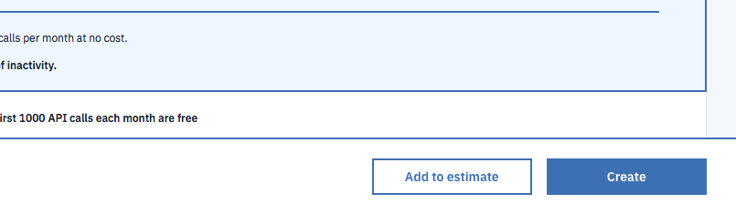

Don't Send That Email!
=====================

*Don’t Send That Email* helps users send messages to coworkers, family or friends that convey the right tone. Sometimes it's hard to intepret the emotional message of an email or text.
DSTE uses an AI to preview the emotional tone of a message. Users can avoid sending a work email that sounds too casual. They can send personal messages that avoid negativity or hostility.
This puts a barrier between you and a bad email or messaging experience. We'll help you send a good email that conveys the right emotional tone.

##### Set up instructions

To clone the app to your local machine, follow these instructions.

1.  Go to your command line and type `git clone https://github.com/Lambda-School-Labs/dont-send-that-email.git`
  This will clone the app onto your local machine.

2. `cd` into `dont-send-that-email`. You will find two directories. `client` and `server` 
  In both directories you need to type `npm install` to get all the libraries that help run the app.

3. In both the `client` and `server` directories you need to create a file called `.env`. It has to have the period before `env`.

4. In the `.env` files you will need to copy and paste the secret keys we use in the app.

5. You will need to make three accounts for three keys. See below on how to get these keys.
  * The Watson API key
  * The Stripe key
  * Auth0 key

6. In the `server` directory you need to get Knex. It's a library we use to manage our databases.
  Get it by typing `npm intal knex`. This will install knex so you can install the database.

8. After you have Knex. In the `server` directory type `knex migrate:latest`.

7. Once you have your keys copied into the `.env` file in both `client` and `server` directories, you can run `npm start` in both directories.
  You should see `Server running on port: 5000` in the `server` directory.
  You should see `something` in the `client` directory.

Before you can run the app locally, you need some secret keys that make the run behind the scenes.

Keys needed
1. IBM Watson Tone Analysis API key
2. Stripe API key.

##### Instructions for obtaining a Watson API key.

1. You have to create an account, confirm it via email then log in. [Go to the IBM site and make an account](https://cloud.ibm.com/registration?target=%2Fcatalog%2Fservices%2Ftone-analyzer%3FhideTours%3Dtrue%26?cm_sp=WatsonPlatform-WatsonPlatform-_-OnPageNavCTA-IBMWatson_ToneAnalyzer-_-Watson_Developer_Website)

2. After you have created an account and logged in [visit this link](https://cloud.ibm.com/catalog/services/tone-analyzer?hideTours=true&?cm_sp=WatsonPlatform-WatsonPlatform-_-OnPageNavCTA-IBMWatson_ToneAnalyzer-_-Watson_Developer_Website).

  In the lower right corner there is a `create` button. Click it to create your Watson Tone Analyzer resource.

  

3. After you create the resource you will see a menu on the left. It looks like this.

  

4. Click on the `Service Credentials` option.

5. On this page you will see a `New Credential` button. Click it. 
  You'll be given a pop-out window for options. You won't need to do anything but click `Add`.

6. After that you will see a screen that lists your credentials. You have to click the `view credentials` button to see your API key.
   The API key data will look like this:
   

7. Copy and paste this API key into your `.env` file located in the root of the `server` directory.

Live Page URL: https://dont-send-that-email.netlify.com/

Click 'Get Started' on the Landing Page.

Log in with a google account.

This takes us to the home page, where documents are displayed. We can navigate to the create email page by clicking the 'Create Email' button. 

On the create email page, there are three input fields. From top to bottom, they are: the title of the email; the addressee of the email; and the body of the email.
We can click the 'Previous' or 'Next' arrow buttons to switch between versions of emails we have written. We can click on the 'Analyze' button to have our email analyzed for emotion analysis. We can click on the 'Save' button to save any changes made to their email. Lastly, we can send an email using the 'Send' button.

We can navigate to the Profile page to see user info and comparisons between free and paid services for the app. The 'Subscribe 30 Days' button can be clicked to add payment details and pay for a month of subscription.

Tech Used:
    Front End: React, React Router, Reactstrap, Axios

    Back End : Express, Node, Passport, Knex, Bcrypt

    APIs     : IBM Watson, Stripe, OAuth

    Libraries: Paper Kit 2 (Bootstrap V4)

    Services : Netlify, Heroku

#Collaborators

[Tai Le](https://github.com/Ta1grr)

[Richard Verdier](https://github.com/rverdi642)

[Jared Cuffe](https://github.com/jcuffe)

[Fred Sohn](https://github.com/fron12)

[Chad Jemmett](https://github.com/ceejaay)

[Will Kwon](https://github.com/wtkwon)

Project Manager: [Thomas Greenhalgh](https://github.com/tgreenhalgh)

v>Icons made by <a href="https://www.freepik.com/" title="Freepik">Freepik</a> from <a href="https://www.flaticon.com/"                 title="Flaticon">www.flaticon.com</a> is licensed by <a href="http://creativecommons.org/licenses/by/3.0/"                 title="Creative Commons BY 3.0" target="_blank">CC 3.0 BY</a>

