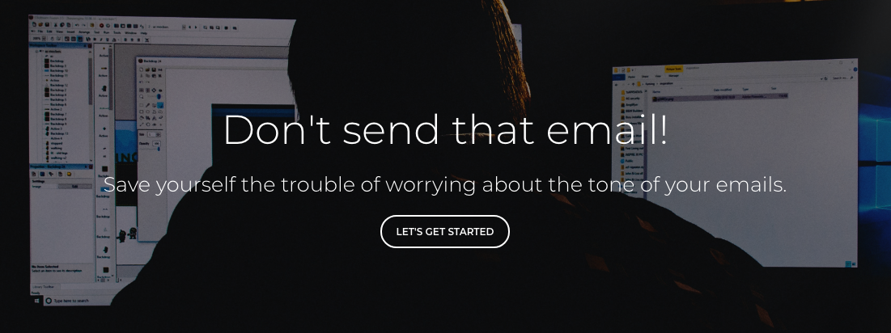

Don't Send That Email!
=====================


*Don’t Send That Email* helps users send messages to coworkers, family or friends that convey the right tone. Sometimes it's hard to intepret the emotional message of an email or text.
*DSTE* uses an AI to preview the emotional tone of a message. Users can avoid sending a work email that sounds too casual. They can send personal messages that avoids negativity or hostility.
This puts a barrier between you and a bad email or messaging experience. We'll help you send a good email that conveys the right emotional tone.


##### Set up instructions

To clone the app to your local machine, follow these instructions.

1. Go to your command line and type `git clone https://github.com/Lambda-School-Labs/dont-send-that-email.git`
   This will clone the app onto your local machine.

2. `cd` into `dont-send-that-email`. You will find a list of files. The two you will be using are `client` and `server`.
   In both `client` and `server` directories you need to type `npm install` to get all the libraries that help run the app.

3. In both the `client` and `server` directories you will find a file called `dotenv` change those files to `.env`.  It has to have the period before `env`.

4. In the `.env` files you will see a list of the secret keys we use. Some of them are missing. You will need to get your own versions of those keys.  See the next step on getting those secret keys.

*An example of the server .env file*

``` STRIPE_API_KEY="paste your own key here"
    AUTH0_CLIENT_ID="paste your own key here"
    AUTH0_DOMAIN="dont-send-that-email.auth0.com"
    AUTH0_CLIENT_SECRET="paste your own key here"
    AUTH0_CALLBACK_URL="http://localhost:5000/auth/callback"
    API_KEY="paste your own Watson key here"
    REACT_APP_BACKEND_URL="http://localhost:5000"
    FRONT_END_URL="http://localhost:3000" 
```


*An example of the client .env file*

```
    REACT_APP_LOGIN_URL="http://localhost:5000/auth/login"
    REACT_APP_PROFILE_URL="http://localhost:5000/auth/profile"
    REACT_APP_EMAILS_URL="http://localhost:5000/emails/"
    REACT_APP_PAYMENT_SERVER_URL="http://localhost:5000/billing"
    REACT_APP_STRIPE_API_PUBLISH_KEY="paste your own key here"
    REACT_APP_BACKEND_URL="http://localhost:5000"
    FRONT_END_URL="http://localhost:3000" 
```


5. You will need to make three accounts for three keys. Follow the links below to get those keys.

  * [IBM Watson Tone Analysis API key](docs/watson/README.md)
  * [The Stripe key](docs/stripe/stripe.md)
  * [Auth0 key](docs/Auth0/README.md)

6. In the `server` directory you need to get Knex. It's a library we use to manage our databases.
  Get it by typing `npm install knex`. This will install knex so you can use the database.

8. After you have Knex. In the `server` directory type `knex migrate:latest`.

7. Once you have your keys copied into the `.env` file in both `client` and `server` directories, you can run `npm start` in both directories.
  You should see `Server running on port: 5000` in the `server` directory.
  After running `npm start` in the `client` directory you should see the app open automatically in your browser.

8. You will see the working app in your browser. You should see the image on our landing page.


*Don't send that email Landing page*


To use the app:
##### Landing Page
  1. Click **Get Started** on the landing page.
  2. Log in with your google account.

##### A list of the user's documents
  1. This takes you to the home page. You will see a **create email** button.
  2. Clicking the **create email** brings you to the email editing page.
  3. Use the hamburger menu icon to navigate to **Home** **Profile** or to **Sign Out**.

##### Edit a message page
  1. You can fill in the fields with your addressee, subject and email body.
  2. At any time you can click **save** or **analyze**
  3. If you change the message you can save again. 
  4. Use the **left** and **right** arrow buttons to navigate between older and newer versions of your message.
  5. At anytime you can click **save** to save a new version or **analyze** to update the analysis of your message.


##### Profile Page
  1. Here you can view your user privleges.
  2. You can **Subscribe** by clicking the button.


##### Visit our live site by clicking the link below

Live Page URL: https://dont-send-that-email.netlify.com/


Tech Used:
    Front End: React, React Router, Reactstrap, Axios

    Back End : Express, Node, Passport, Knex, Bcrypt

    APIs     : IBM Watson, Stripe, OAuth

    Libraries: Paper Kit 2 (Bootstrap V4)

    Services : Netlify, Heroku

## Collaborators

[Tai Le](https://github.com/Ta1grr)

[Richard Verdier](https://github.com/rverdi642)

[Jared Cuffe](https://github.com/jcuffe)

[Fred Sohn](https://github.com/fron12)

[Chad Jemmett](https://github.com/ceejaay)

[Will Kwon](https://github.com/wtkwon)

Project Manager: [Thomas Greenhalgh](https://github.com/tgreenhalgh)


Favicon made by <a href="https://www.freepik.com/" title="Freepik">Freepik</a> from <a href="https://www.flaticon.com/"                 title="Flaticon">www.flaticon.com</a> is licensed by <a href="http://creativecommons.org/licenses/by/3.0/"                 title="Creative Commons BY 3.0" target="_blank">CC 3.0 BY</a></div>
