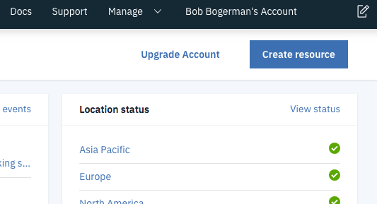
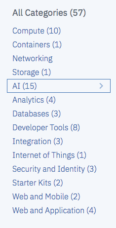
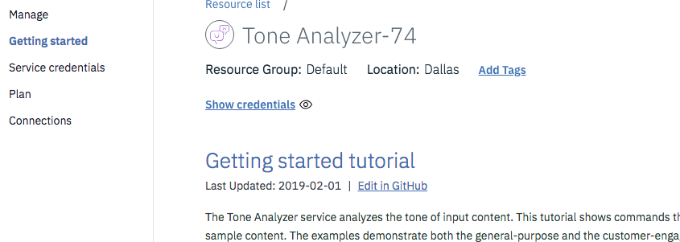
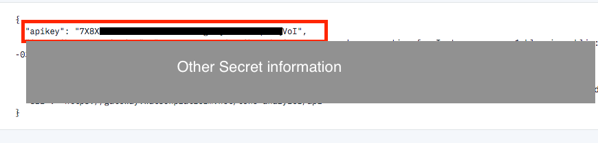

Don't Send That Email!
=====================

*Don’t Send That Email* helps users send messages to coworkers, family or friends that convey the right tone. Sometimes it's hard to intepret the emotional message of an email or text.
DSTE uses an AI to preview the emotional tone of a message. Users can avoid sending a work email that sounds too casual. They can send personal messages that avoid negativity or hostility.
This puts a barrier between you and a bad email or messaging experience. We'll help you send a good email that conveys the right emotional tone.

##### Set up instructions

Keys needed

This is how you get an API key for Watson.

1. You have to create an account, confirm it via email then log in. [Go to the IBM site and make an account](https://www.ibm.com/watson/services/tone-analyzer/)

2. After you have created an account and logged in you will see the dashboard.
  In the upper right corner, click the button that says `Create a resource`

  

3. From the list of resources on the left-hand side click `AI` 

4. Find Tone Analyzer in the group of tiles.
  After you click the Tone Analyzer card. You will see a list a page that offers options. You can choose a region that is closest to you. You will also see the limitations of the free version of the IBM Watson service. In this case, you will get 2500 API calls a month.

5. At the bottom of the screen there is a `create` button. Click it.
This will bring you to a `Getting started` tutorial. On the left hand side you will see a sidebar menu. 

6. Click on the `Service Credentials` option.

7. On this page you will see a `New Credential` button. Click it. You'll be given a pop-out window for options. You won't need to do anything but click `Add`.

8. After that you will see a screen that lists your credentials. You have to click the `view credentials` button to see your API key.
   The API key data will look like this:
   

9. Copy and paste this API key into your `.env` file located in the root of the `server` directory.

Tech Used:
    
    Front End: React, React Router, Reactstrap, Axios

    Back End : Express, Node, Passport, Knex, Bcrypt

    APIs     : IBM Watson, Stripe, OAuth

    Libraries: Paper Kit 2 (Bootstrap V4)

    Services : Netlify, Heroku

Live Page URL: https://dont-send-that-email.netlify.com/

Local Deployment Instructions:

Click 'Get Started' on the Landing Page.

Log in with a google account.

This takes us to the home page, where documents are displayed. We can navigate to the create email page by clicking the 'Create Email' button. 

On the create email page, there are three input fields. From top to bottom, they are: the title of the email; the addressee of the email; and the body of the email.
We can click the 'Previous' or 'Next' arrow buttons to switch between versions of emails we have written. We can click on the 'Analyze' button to have our email analyzed for emotion analysis. We can click on the 'Save' button to save any changes made to their email. Lastly, we can send an email using the 'Send' button.

We can navigate to the Profile page to see user info and comparisons between free and paid services for the app. The 'Subscribe 30 Days' button can be clicked to add payment details and pay for a month of subscription.

#Collaborators

[Tai Le](https://github.com/Ta1grr)

[Richard Verdier](https://github.com/rverdi642)

[Jared Cuffe](https://github.com/jcuffe)

[Fred Sohn](https://github.com/fron12)

[Chad Jemmett](https://github.com/ceejaay)

[Will Kwon](https://github.com/wtkwon)

Project Manager: [Thomas Greenhalgh](https://github.com/tgreenhalgh)

