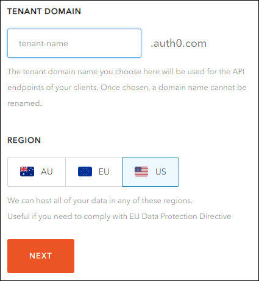
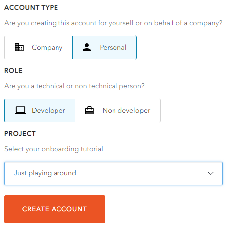
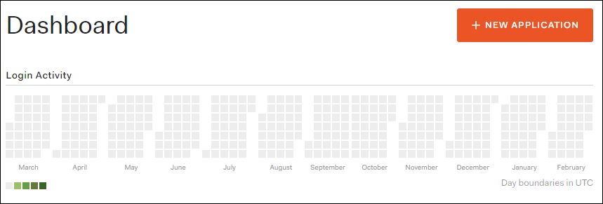
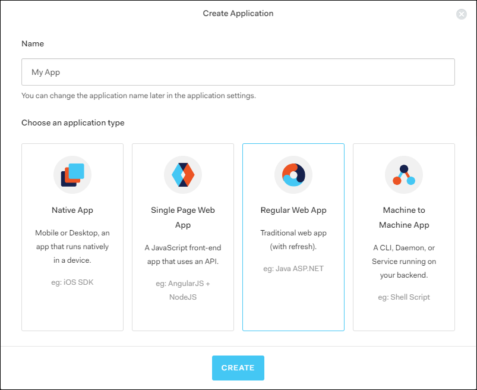
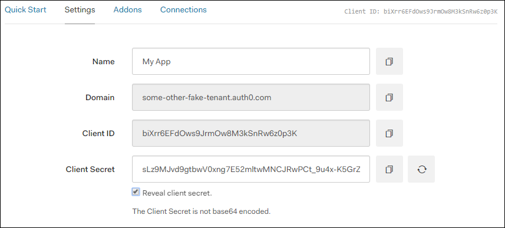
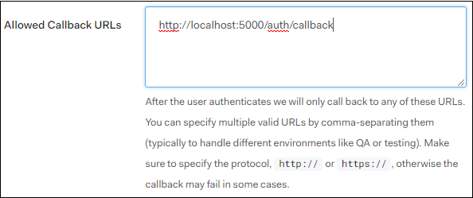

# Auth0 configuration

Auth0 is the service used for authenticating our application's users. To use this service, several keys are required, which must be obtained by creating a `tenant` on the Auth0 service, and subsequently creating an `application` which will manage users.

## Instructions

1. Navigate to the [Auth0 website](https://auth0.com) and click the `Sign Up` button.

2. Create an account using your email or an OAuth provider.

3. Create a new `tenant` with a unique name.

4. Choose a personal account, and skip the onboarding tutorial.

5. Upon reaching your dashboard, click the `New Application` button.

6. Choose the type `Regular Web App`, and skip the section asking you to choose your tech stack.

7. Once you've created the app, locate the API keys in the top fields of the `Settings` tab, and copy them into the `.env` file located in the `server/` directory.

8. Locate the `Allowed Callback URLs` field under the `Settings` tab, and add this URL: `http://localhost:5000/auth/callback`.

9. Scroll past the remaining fields, locate and click on the `Save Changes` button.

