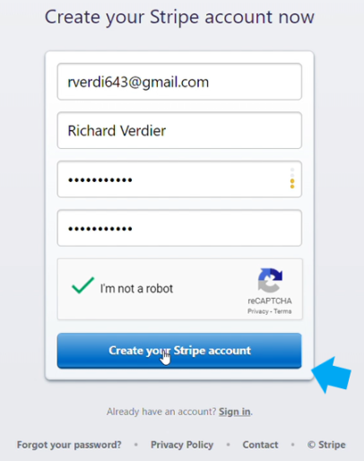
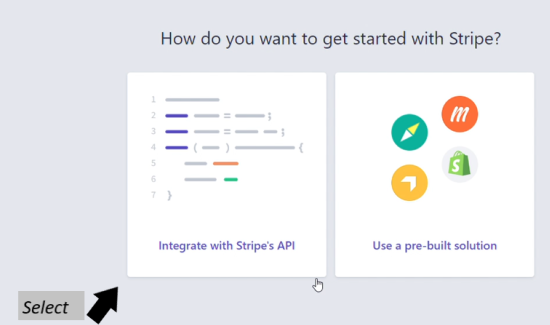
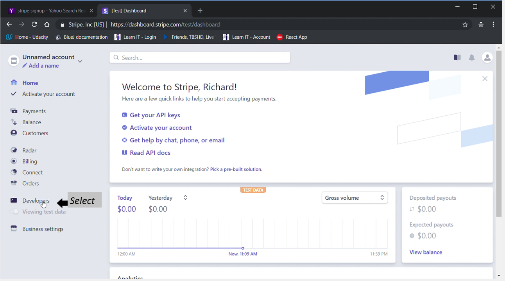
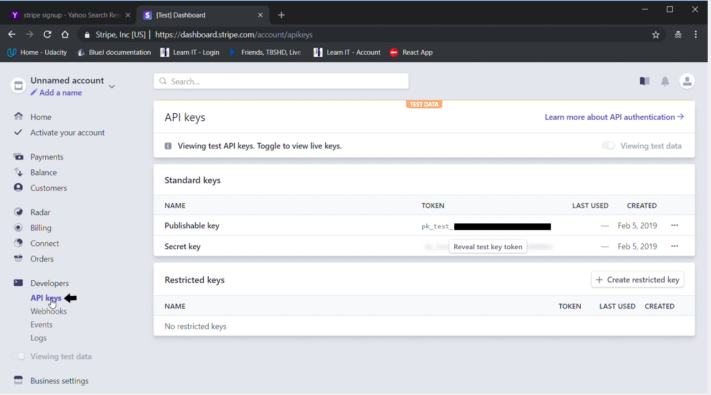

#### Instructions for obtaining a Stripe API key.
---
1. You have to create an account, confirm it via email then log in. [Go to the Stripe site and make an account](https://dashboard.stripe.com/register)

    

     *The filled out form above is only for **example**, please provide the appropriate entries for your organization*

---

2. Having selecting **Create Your Stripe Account** on the form shown above, you will be presented with following page below.

---

3. Finishing Obtaining the API keys.

    

    *   Please select Integrate with Stripes API

    *   Next, you will be presented with the following dashboard

    

    * Select `Developer` as shown in the lower left side menu

    

    * On the above page where you see **"Standard Keys"** in the center of the page:

    * Copy and Paste ==> **Publishable Key** into your `.env` file, located at the root of your `client directory`.

      * The line in your respective `.env` file will look like the following below:
---

`REACT_APP_STRIPE_API_PUBLISH_KEY`=**YOUR KEY HERE**

---

  * Copy and Paste ==> **Secret Key** into your `.env` file, located at the root of your `server directory`.

      * The line in your respective `.env` file will look like the following below:
---

`STRIPE_API_KEY`=**YOUR KEY HERE**

---

