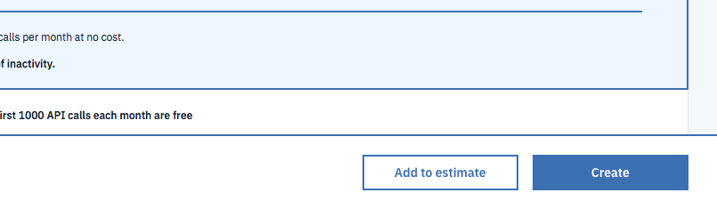
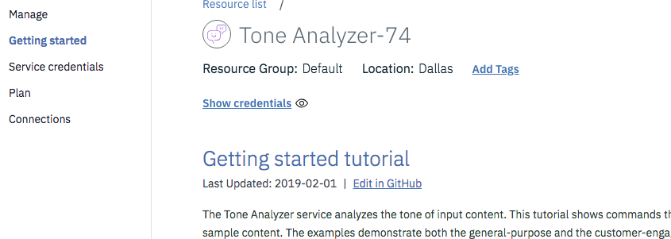
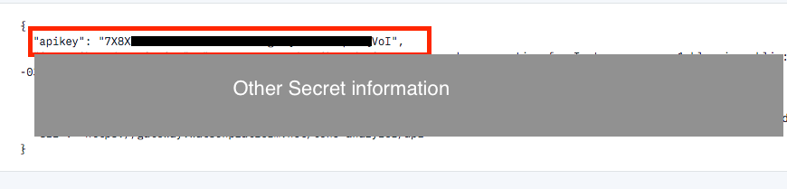

##### Instructions for obtaining a Watson API key.

1. You have to create an account, confirm it via email then log in. [Go to the IBM site and make an account](https://cloud.ibm.com/registration?target=%2Fcatalog%2Fservices%2Ftone-analyzer%3FhideTours%3Dtrue%26?cm_sp=WatsonPlatform-WatsonPlatform-_-OnPageNavCTA-IBMWatson_ToneAnalyzer-_-Watson_Developer_Website)

2. After you have created an account and logged in [visit this link](https://cloud.ibm.com/catalog/services/tone-analyzer?hideTours=true&?cm_sp=WatsonPlatform-WatsonPlatform-_-OnPageNavCTA-IBMWatson_ToneAnalyzer-_-Watson_Developer_Website).

  In the lower right corner there is a `create` button. Click it to create your Watson Tone Analyzer resource.

  

3. After you create the resource you will see a menu on the left. It looks like this.

 

4. Click on the `Service Credentials` option.

5. On this page you will see a `New Credential` button. Click it. 
  You'll be given a pop-out window for options. You won't need to do anything but click `Add`.

6. After that you will see a screen that lists your credentials. You have to click the `view credentials` button to see your API key.
   The API key data will look like this:
 

7. Copy and paste this API key into your `.env` file located in the root of the `server` directory.
